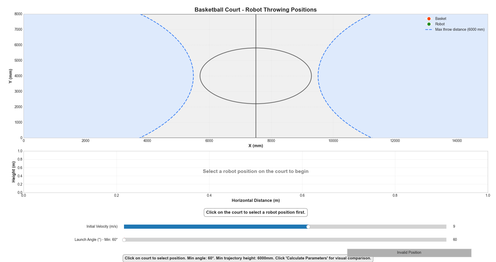

# Basketball Robot Throwing Simulator

An interactive visualization tool for simulating and optimizing basketball throwing trajectories for robotics applications.



## Overview

This simulator helps determine optimal robot positions and throwing parameters for a basketball-throwing robot. It provides a visual representation of the basketball court, valid throwing positions, and trajectory simulations based on physics principles.

## Features

- **Interactive Court Visualization**: Click on the court to position your robot
- **Real-time Trajectory Visualization**: See the ball's path with current parameters
- **Parameter Optimization**: Find the optimal velocity and angle combinations
- **Visual Comparison**: Compare different parameter sets side-by-side
- **Physics-based Simulation**: Accurate projectile motion with gravity effects
- **Draggable Angle Adjustment**: Visually adjust launch angle by dragging
- **Configurable Constraints**: Customizable minimum heights, angles, and velocities

## Requirements

The following constraints are built into the simulation:

- Robot throwing distance: under 6000 mm (3D distance)
- Basket height: 2430 mm
- Basketball court dimensions: 15000×8000 mm
- Minimum launch angle: 60 degrees
- Minimum trajectory peak height: 6000 mm
- Maximum initial velocity: 15 m/s

## Dependencies

- Python 3.6+
- NumPy
- Matplotlib
- Math

## Installation

1. Clone the repository:
   ```bash
   git clone https://github.com/BK-Robotics/software_robocon_2025.git
   cd basketball-simulator
   ```

2. Install required packages:
   ```bash
   pip install numpy matplotlib
   ```

## Usage

Run the simulator with:

```bash
python3 main.py
```

### Basic Usage Guide:

1. **Position the Robot**: Click anywhere on the basketball court
2. **Adjust Parameters**: Use the sliders to change velocity and angle
3. **Calculate Optimal Values**: Click "Calculate Parameters" to find the best combinations
4. **Compare Options**: View the comparison window showing different parameter sets
5. **Visual Angle Adjustment**: Drag the red angle indicator to adjust the launch angle

## File Structure

The code is organized into modular components:

- **main.py**: Entry point that runs the simulator
- **constants.py**: Configuration parameters and color schemes
- **physics.py**: Trajectory calculations and physics functions
- **court_visualization.py**: Basketball court drawing functions
- **trajectory_visualization.py**: Trajectory plotting functions
- **parameter_optimization.py**: Parameter calculation algorithms
- **ui_components.py**: UI elements and event handlers

## How It Works

### Physics Model

The simulator uses standard projectile motion equations:

- `x(t) = v₀ × cos(θ) × t`
- `y(t) = h₀ + v₀ × sin(θ) × t - 0.5 × g × t²`

Where:
- `v₀` is initial velocity
- `θ` is launch angle
- `h₀` is initial height
- `g` is gravitational acceleration (9.81 m/s²)
- `t` is time

### Parameter Optimization

The optimizer searches through combinations of velocities and angles to find:
- Minimum velocity that results in a basket
- Maximum velocity (up to 15 m/s) that works
- Minimum angle (at least 60°) that works
- Maximum angle that results in a basket

Each solution must satisfy:
- Ball trajectory peak must be at least 6 meters high
- Ball must pass through the basket (within basket radius)
- Launch angle must be at least 60 degrees
- Initial velocity cannot exceed 15 m/s

## Example Results

When positioning the robot at valid locations, the simulator will calculate and display:

```
MIN VELOCITY: 8.25 m/s at 64.5°  |  MAX VELOCITY: 15.00 m/s at 60.0°
MIN ANGLE: 60.0° at 15.00 m/s  |  MAX ANGLE: 75.2° at 9.85 m/s
```

## License

This project is licensed under the MIT License - see the LICENSE file for details.

## Credits

Developed for robotics applications in basketball throwing mechanisms.

---

*Note: This simulator is for educational and planning purposes. Real-world implementations would need to account for additional factors like air resistance, spin, and mechanical limitations.*
